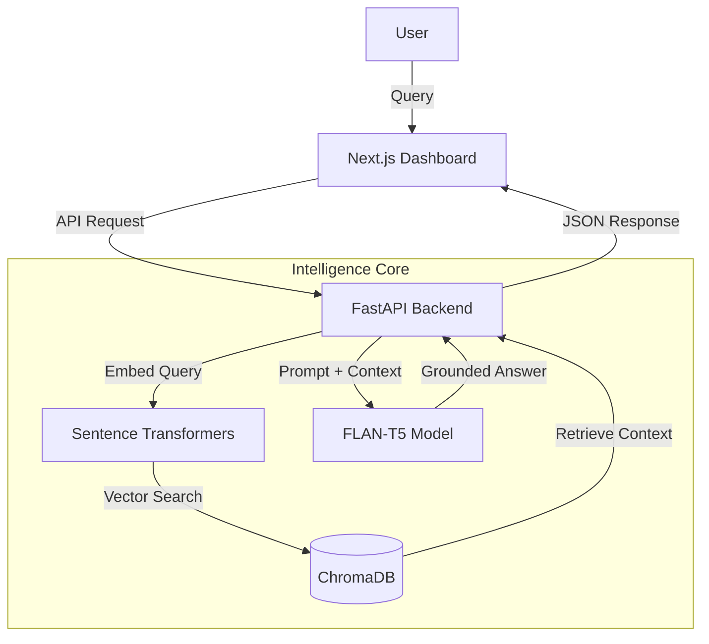

# CrediTrust: Enterprise RAG Analytics Platform

**Turn customer complaints into actionable financial insights.**

CrediTrust is a production-grade **Retrieval-Augmented Generation (RAG)** system that transforms raw financial narratives into grounded business intelligence. Built with a "Privacy-First" local AI architecture, it ensures every insight is traceable back to real-world evidence.

---

## 🎥 Video Demo

<video src="vedio/CrediTrust _ Enterprise RAG AI.mp4" controls="controls" style="max-width: 100%;">
</video>

*[Download Demo Video](vedio/CrediTrust%20_%20Enterprise%20RAG%20AI.mp4)*

---

## 🚀 Key Features

### 🏛️ Enterprise-Grade Dashboard
- **Multi-Module Architecture**: Seamless navigation between AI Research, Market Analytics, and Historical Archives.
- **Dark/Light Mode**: Fully responsive theming with persistent user preferences.
- **Glassmorphism Design**: High-end UI with `framer-motion` animations and `geist-sans` typography.

### 🧠 Grounded Intelligence (RAG)
- **Zero Hallucination**: The system refuses to answer if it cannot find evidence in the vector database.
- **Traceable Citations**: Every claim is backed by a "Source Card" with the original complaint text and Case ID.
- **Structured Logic**: Answers are automatically partitioned into an **Executive Summary (TL;DR)** and **Deep Context Analysis**.

### 📊 Market Analytics
- **Interactive Visualizations**: Real-time charts powered by `Recharts` showing:
    - Complaint Volume Trends (Area Chart)
    - Product Category Distribution (Donut Chart)
    - Friction Point Intensity (Bar Chart)

### 🛡️ System Core
- **Self-Hosted AI**: Runs entirely on local hardware using `FLAN-T5` and `ChromaDB`.
- **Zero Cost**: Built 100% with open-source software—no OpenAI or API fees required.

---

## 🛠️ Technology Stack

| Layer | Component | Purpose |
| :--- | :--- | :--- |
| **Frontend** | `Next.js 16` | React Framework (App Router + Turbopack) |
| **Language** | `TypeScript` | Type-safe Codebase |
| **Styling** | `TailwindCSS` | Utility-first Design System |
| **UI Library** | `shadcn/ui` | Accessible Component Primitives |
| **Backend** | `FastAPI` | High-performance Python API |
| **Vector DB** | `ChromaDB` | Semantic Search Engine |
| **LLM** | `FLAN-T5` | Local text generation model |
| **Orchestration** | `Python 3.9+` | Data Pipeline & Embedding Logic |

---

## 🏗️ Architecture



---

## ⚡ Getting Started

### Prerequisites
- **Node.js 18+**
- **Python 3.9+**

### 1. Backend Setup
The backend handles the AI logic and database connection.

```bash
# Install dependencies
pip install -r requirements.txt

# Create the Vector Index (Run once)
python src/embedding_pipeline.py

# Start the API
uvicorn src.api:app --host 0.0.0.0 --port 8000
```

### 2. Frontend Setup
The frontend provides the interactive dashboard.

```bash
# Navigate to UI
cd ui

# Install dependencies
npm install

# Start Development Server
npm run dev
```

Open [http://localhost:3000](http://localhost:3000) to access the platform.

---

## 📦 Deployment

### Zero-Cost Stack
This project is designed to be deployed for **$0/month**:
- **Frontend**: Deploy to Vercel (Free Tier).
- **Backend**: Deploy to Render or Railway (Free/Trial Tier).
- **Database**: Use Supabase or self-hosted ChromaDB on the backend instance.

For a full deployment guide, see [deployment_tools.md](deployment_tools.md).

---

## � License

This project is open-source and available under the [MIT License](LICENSE).

---

*Verified Portfolio Project · 2026*
