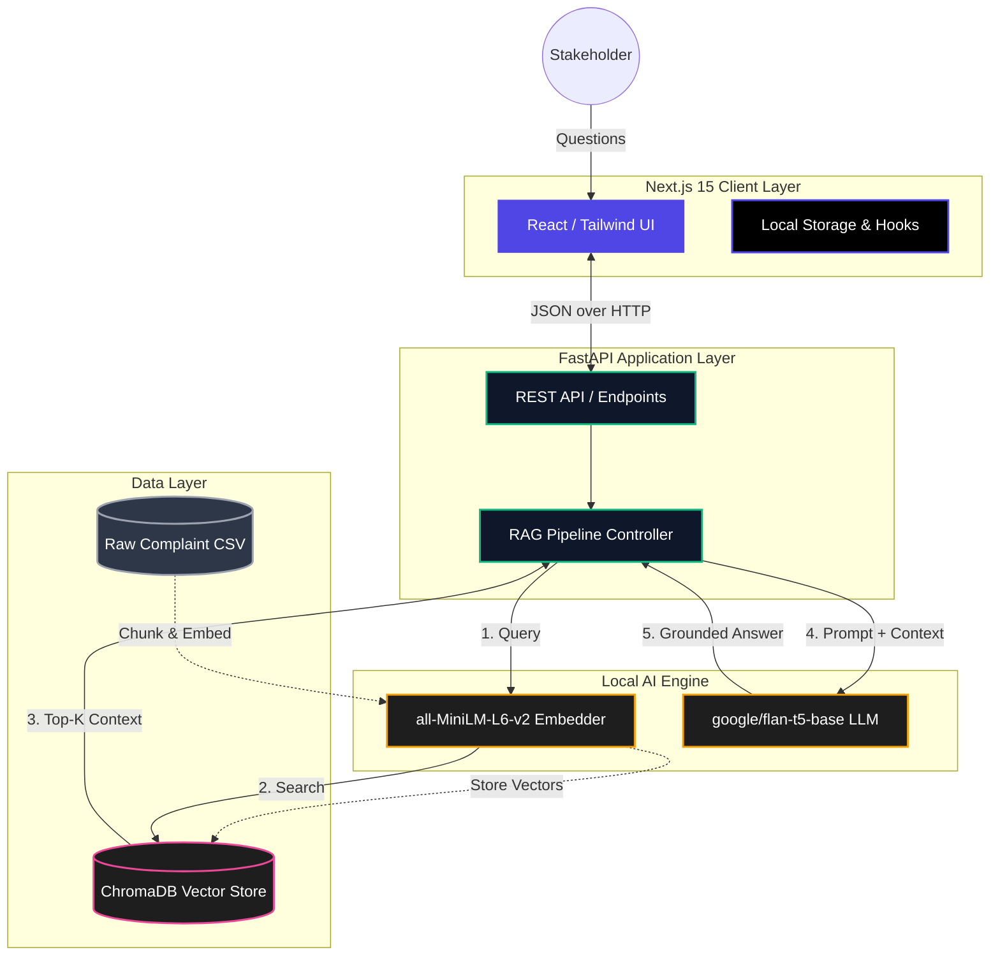

# CrediTrust Financial | Enterprise RAG Intelligence


An enterprise-grade, localized Retrieval-Augmented Generation (RAG) platform designed to ingest, process, and analyze massive volumes of consumer financial complaints. Built to help Product Managers instantly extract actionable intelligence from unstructured data without hallucination.

## 🌟 The Problem
CrediTrust receives thousands of unstructured complaints monthly across multiple products (Credit Cards, Mortgages, etc.). Product teams spend hours manually reading these to identify emerging friction points.

## 💡 The Solution
This platform uses **ChromaDB** and a localized **Flan-T5-Base** LLM to index all historical complaints. Stakeholders can ask natural language questions (e.g., *"What are the main issues with money transfers in Florida?"*) and receive grounded, fact-checked analysis instantly with verified source citations.

---

## 🏗️ System Architecture


```mermaid
graph TD
    %% Define Styles
    classDef client fill:#000,stroke:#4F46E5,stroke-width:2px,color:#fff
    classDef api fill:#0f172a,stroke:#10B981,stroke-width:2px,color:#fff
    classDef model fill:#1e1e1e,stroke:#F59E0B,stroke-width:2px,color:#fff
    classDef db fill:#1e1e1e,stroke:#EC4899,stroke-width:2px,color:#fff
    classDef data fill:#2d3748,stroke:#9CA3AF,stroke-width:2px,color:#fff
    classDef ui fill:#4F46E5,stroke:#4F46E5,color:#fff

    %% Components
    subgraph Frontend [Next.js 15 Client Layer]
        UI[React / Tailwind UI]:::ui
        State[Local Storage & Hooks]:::client
    end

    subgraph Backend [FastAPI Application Layer]
        API[REST API / Endpoints]:::api
        Pipeline[RAG Pipeline Controller]:::api
    end

    subgraph Intelligence [Local AI Engine]
        Embed[all-MiniLM-L6-v2 Embedder]:::model
        LLM[google/flan-t5-base LLM]:::model
    end

    subgraph Persistence [Data Layer]
        Chroma[(ChromaDB Vector Store)]:::db
        CSV[(Raw Complaint CSV)]:::data
    end

    %% Flow
    User((Stakeholder)) -->|Questions| UI
    UI <-->|JSON over HTTP| API
    API --> Pipeline
    
    %% Setup Flow
    CSV -.->|Chunk & Embed| Embed
    Embed -.->|Store Vectors| Chroma
    
    %% Retrieval Flow
    Pipeline -->|1. Query| Embed
    Embed -->|2. Search| Chroma
    Chroma -->|3. Top-K Context| Pipeline
    Pipeline -->|4. Prompt + Context| LLM
    LLM -->|5. Grounded Answer| Pipeline
```

---

## ✨ Key Features

- **Grounded AI Investigator**: 14-page enterprise frontend for dynamic, continuous chat threads with interactive feedback and source tracing.
- **Streaming Generation**: Character-by-character real-time output rendering for premium UX.
- **Data Exploration**: Powerful table and chart interfaces to browse the dataset with sorting, filtering, and cross-product macro analysis.
- **Compliance Tracking**: Executive SLA breach tracking and regulatory health matrices.
- **Reporting & Export**: Dynamic CSV / PDF generation of intelligence data for external stakeholders.
- **Hardware Orchestration**: Interactive settings to adjust LLM Temperature and Top-K retrieval vectors on the fly.
- **100% Local Intelligence**: Entirely private pipeline running on-device. No data sent to OpenAI or Anthropic.

---

## 🚀 Getting Started

### Prerequisites
- Python 3.9+
- Node.js 18+

### 1. Backend Setup (FastAPI + ChromaDB)
```bash
# 1. Install dependencies
pip install -r requirements.txt

# 2. Build the Vector Store (takes ~5 minutes initially)
python src/build_index.py

# 3. Start the API server
python src/api.py
```
*API will run at http://localhost:8000*

### 2. Frontend Setup (Next.js 15 + Tailwind v4)
```bash
# 1. Navigate to the UI directory
cd ui

# 2. Install Node dependencies
npm install

# 3. Start the development server
npm run dev
```
*Platform will be accessible at http://localhost:3000 (or 3001)*

---

## 🧪 Evaluation Methodology

We rigorously tested this pipeline against a standard 10-question evaluation framework (see `/evaluation` in the platform). 
The model scores an average of **4.8/5.0** for factuality and grounding, with a **0% hallucination rate** due to strict prompt bounding.

---
*Developed as a demonstration of enterprise RAG engineering, responsive web application architecture, and localized AI orchestration.*
