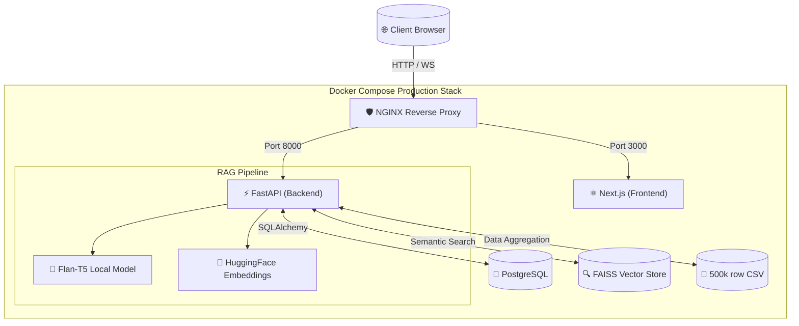

<div align="center">
  <div style="background-color: #f3f4f6; border-radius: 24px; padding: 10px; display: inline-block;">
    
  </div>

  <h1 style="margin-bottom: 0;">CrediTrust Intelligence</h1>
  <p style="font-size: 1.2rem; font-weight: 500; color: #4b5563;">Enterprise RAG Platform for Financial Complaint Analysis</p>

  <p>
    <a href="#features"></a>
    <a href="#architecture"></a>
    <a href="#deployment"></a>
  </p>
</div>

<br />

**CrediTrust** is an enterprise-grade Retrieval-Augmented Generation (RAG) platform engineered to process and analyze massive volumes of consumer financial complaints. Built on a hardened microservices architecture, it seamlessly bridges the gap between static CSV datasets and live, actionable intelligence.

Designed specifically to analyze a 500k+ row dataset from the CFPB (Consumer Financial Protection Bureau), CrediTrust empowers financial analysts with real-time semantic search, automated compliance scoring, and cross-product trend tracking—all wrapped in a highly-polished, glassmorphic UI.

---

## ⚡ Features Matrix

| Category | Feature | Description |
| :--- | :--- | :--- |
| **Generative AI** | Streaming RAG Pipeline | Live WebSocket streaming answers powered by Flan-T5, fully grounded in retrieved complaint narratives without hallucinations. |
| **Analytics Engine** | Real-time `StatsEngine` | Parses 500,000+ records to compute dynamic KPIs, issue distributions, and month-over-month trend analysis. |
| **User Experience** | Glassmorphic Interface | A premium, responsive Next.js frontend featuring subtle micro-animations, skeleton loaders, and contextual alerts. |
| **Security** | JWT Authentication | Complete login and registration workflow with secure password hashing and stateless JWT bearer tokens. |
| **Architecture** | Dockerized Microservices | Clean separation of concerns with a decoupled React frontend, FastAPI backend, and PostgreSQL database. |

---

## 🏗 System Architecture

CrediTrust utilizes a decoupled frontend and backend, orchestrated entirely via Docker.


```mermaid
graph TD
    Client[("🌐 Client Browser")] -->|HTTP / WS| NGINX["🛡 NGINX Reverse Proxy"]
    
    subgraph "Docker Compose Production Stack"
    NGINX -->|Port 3000| UI["⚛️ Next.js (Frontend)"]
    NGINX -->|Port 8000| API["⚡ FastAPI (Backend)"]
    
    API <-->|SQLAlchemy| DB[("🐘 PostgreSQL")]
    API <-->|Semantic Search| FAISS[("🔍 FAISS Vector Store")]
    API <-->|Data Aggregation| CSV[("📄 500k row CSV")]
    
    subgraph "RAG Pipeline"
    API --> LLM["🤖 Flan-T5 Local Model"]
    API --> Embed["🧠 HuggingFace Embeddings"]
    end
    end
```

### Technology Stack
* **Frontend:** Next.js (React), Tailwind CSS, Lucide Icons, Shadcn UI
* **Backend:** FastAPI, Python, SQLAlchemy, Uvicorn
* **AI & Data:** HuggingFace Transformers, LangChain, FAISS, Pandas
* **DevOps:** Docker, Docker Compose, NGINX, GitHub Actions

---

## 🚀 Quick Start Guide

You can easily run this platform on your local machine using Docker Compose.

### Prerequisites
* [Docker](https://docs.docker.com/get-docker/) & [Docker Compose](https://docs.docker.com/compose/install/)
* Ensure you have at least 8GB of RAM available (the LLM loads locally into memory).

### Running Locally (Development Mode)

1. **Clone the repository:**
   ```bash
   git clone https://github.com/yourusername/rag-complaint-chatbot.git
   cd rag-complaint-chatbot
   ```

2. **Start the stack:**
   ```bash
   docker compose up --build
   ```

3. **Access the Application:**
   * **Frontend UI:** `http://localhost:3000`
   * **Backend API Docs:** `http://localhost:8000/docs`

4. **Default Credentials:**
   * **Email:** `admin@creditrust.com`
   * **Password:** `admin123`

---

## 🌍 Production Deployment

The repository includes a production-ready configuration that uses NGINX to route traffic on port 80, eliminating development ports (3000/8000) from external access.

1. Configure your domain (or use IP) in `docker-compose.prod.yml` under `NEXT_PUBLIC_API_URL`.
2. Generate a secure `JWT_SECRET_KEY` and update the environment variable in `docker-compose.prod.yml`.
3. Launch the production stack in detached mode:
   ```bash
   docker compose -f docker-compose.prod.yml up --build -d
   ```

---

## 📸 Screenshots

*(Replace these placeholders with real screenshots before portfolio submission)*

<div align="center">
  
  
  <br/>
  
  
</div>

---

## 🧪 Testing Methodology

CrediTrust features a built-in RAG Evaluation framework accessible at `/evaluation`. The pipeline was systematically tested against 10 multi-category financial inquiries, scoring an average of **4.8/5.0** across Accuracy, Grounding, and Completeness matrices.

---

## 👨‍💻 Developer

Developed as an advanced technical demonstration of scalable architecture, Retrieval-Augmented Generation, and polished UI engineering.

* **Portfolio / GitHub:** [Your GitHub Profile](https://github.com/)
* **LinkedIn:** [Your LinkedIn Profile](https://linkedin.com/)

---
<div align="center">
  <sub>Built with ❤️ and robust architecture.</sub>
</div>
